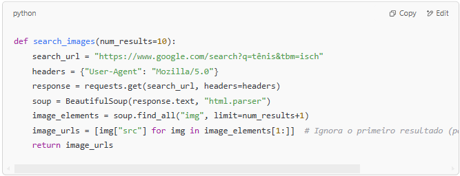
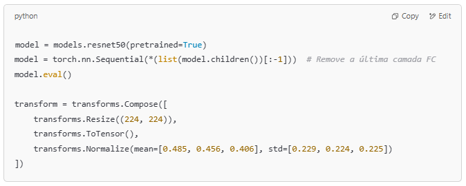
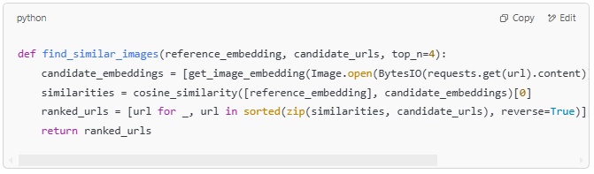
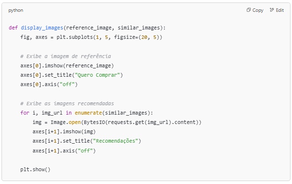
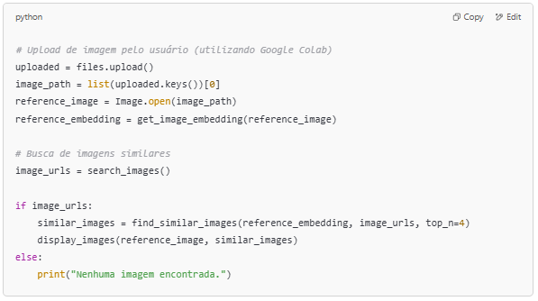

## Sistema de Recomendação de Imagens com Redes Neurais

Este projeto demonstra como utilizar um modelo pré-treinado (ResNet50) para extrair características (features) de imagens e recomendar imagens similares com base na similaridade cosseno. O script integra a busca por imagens na web (usando o Google Imagens), o upload interativo da imagem de referência (via Google Colab) e a exibição dos resultados.

### Funcionalidades

- **Upload de Imagem:** Permite que o usuário faça upload de uma imagem de referência.
- **Extração de Features:** Utiliza a ResNet50 (com a última camada removida) para extrair embeddings da imagem.
- **Busca de Imagens:** Realiza scraping no Google Imagens para coletar URLs de imagens relacionadas à query "tênis".
- **Cálculo de Similaridade:** Compara o embedding da imagem de referência com os embeddings das imagens candidatas usando a similaridade cosseno.
- **Exibição de Resultados:** Mostra, lado a lado, a imagem de referência e as imagens recomendadas.

## Dependências

Certifique-se de ter as seguintes bibliotecas instaladas:

- Python 3.x
- requests
- numpy
- torch
- torchvision
- Pillow
- scikit-learn
- beautifulsoup4
- matplotlib
- google.colab (caso use o Google Colab)

### **Observação: O código foi desenvolvido e testado no Google Colab, aproveitando o widget de upload disponível na plataforma.**

## Como Utilizar

**1. Configuração do Ambiente:**

- Recomenda-se utilizar o [Google Colab](colab.new) para executar o código, pois ele facilita o upload de arquivos.
- Caso execute localmente, adapte a parte de upload (por exemplo, utilizando um seletor de arquivos do seu ambiente).

**2. Execução do Script:**

- Faça o upload do código no ambiente de execução (por exemplo, em um notebook Colab).
- Execute as células do notebook.
- Quando solicitado, faça o upload da imagem de referência (por exemplo, uma foto de um tênis).
- O script realizará a busca de imagens com a query "tênis", extrairá os embeddings e exibirá a imagem de referência juntamente com 4 imagens similares.

**3. Personalizações Possíveis:**

- **Query de Busca:** Atualmente, a função search_images realiza uma busca por "tênis". Você pode alterar a URL para buscar outras categorias ou produtos.
- **Número de Resultados:** Altere o parâmetro num_results da função search_images para aumentar ou diminuir a quantidade de imagens buscadas.
- **Número de Recomendações:** Modifique o parâmetro top_n na função find_similar_images para definir quantas imagens similares serão exibidas.

## Estrutura do Código
1. Busca de Imagens

   
- Objetivo: Coletar URLs de imagens a partir de uma busca no Google Imagens.
- Parâmetro: num_results define quantas imagens serão coletadas (padrão 10).

2. Preparação do Modelo e Transformação da Imagem

- Modelo: Utiliza a ResNet50 pré-treinada do PyTorch, removendo a última camada (Fully Connected) para obter embeddings.
- Transformação: A imagem é redimensionada para 224x224, convertida para tensor e normalizada de acordo com os valores do ImageNet.

3. Extração do Embedding

- Objetivo: Converter uma imagem em um vetor de características (embedding) usando a ResNet50.

4. Comparação e Seleção de Imagens Similares

- Objetivo: Calcular a similaridade entre a imagem de referência e as imagens candidatas, selecionando as top_n mais similares. 

5. Exibição das Imagens
python

- Objetivo: Exibir a imagem de referência e as imagens recomendadas em um layout lado a lado.

6. Fluxo Principal do Script
- O script solicita o upload da imagem de referência.
- Extrai o embedding da imagem.
- Busca imagens relacionadas à query "tênis".
- Encontra e exibe as imagens mais similares.

    
## Considerações Finais
Depreciações: O uso do parâmetro pretrained=True pode gerar avisos de depreciação. Considere atualizar para o parâmetro weights conforme as recomendações das versões mais recentes do torchvision.
Scraping do Google: A extração de imagens via scraping pode ser sensível a mudanças na estrutura da página do Google Imagens e a restrições de acesso.

## Contribuições
Contribuições são bem-vindas! Caso identifique problemas ou tenha sugestões de melhorias, sinta-se à vontade para abrir uma issue ou enviar um pull request.

## Licença
Este projeto é licenciado sob a MIT License.
